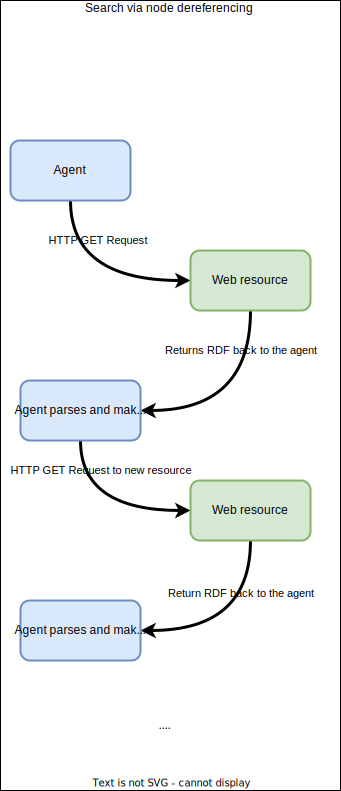
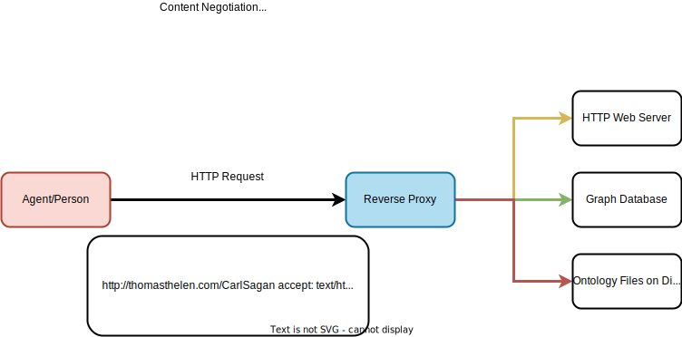

# Agent Ready Linked Data

The semantic web's vision is to have highly structured information on the internet that's easy for agents to ingest. In this model, autonomous agents can freely navigate, understand, and make  decisions while parsing web content. The World Wide Web Consortium (W3C) is largely responsible for fostering this effort, which has led to a number of standards and recommendations. The W3C blessed way of achieving the semantic web is by having HTTP dereferencable URI's (this allows agents to follow information like a linked list) and public SPARQL endpoints where data can be queried freely. 

Most people are able to easily deploy SPARQL endpoints however, few actually _describe_ the endpoint itself: which SPARQL versions are supported, default settings, entailment regimes, and what may have changed in the data since their last visit. This lack of context around data access and endpoint capabilities can lead to poor performing queries, not finding the desired data, and poor agent performance.

The W3C has several recommendations for describing data and services through a set of vocabularies and conventions for retrieving the SPARQL endpoint metadata over HTTP. By leveraging these technologies you can enable agents to better navigate your data and find what the information they're after.

## 1. Describe the SPARQL endpoint and datasets

SPARQL services can be opaque at times: it's difficult to tell which named graph you're in, what's *in* the named graph, what reasoning strategies are available, and which SPARQL version is supported. The [SPARQL Service Description](https://www.w3.org/TR/sparql11-service-description/) specification provides a solution to this by providing an ontology that can be used to describe various aspects of the SPARQL endpoint.

The gist is that the endpoint and data need to be annotated as an RDF document. The document is served when SPARQL endpoint is hit with a GET request _without attached query parameters_. The agent can then parse the RDF (it needs to have knowledge of the service description ontology) and can then query the data with full knowledge of what's possible.

Consider a fictitious geospatial graph database that supports SPARQL access. It supports the RDFS reasoning strategy, federated querying, and has two named graphs. An appropriate service description could look like the following RDF.

```
@prefix sd: <http://www.w3.org/ns/sparql-service-description#> .
@prefix dcterms: <http://purl.org/dc/terms/> .
@prefix rdfs: <http://www.w3.org/1999/02/22-rdf-syntax-ns#> .

<http://thomasthelen.com/not_a_real_sparql_endpoint> a sd:Service ;
  dcterms:description "A fictitious SPARQL endpoint (pretend it's real)" ;
  sd:endpoint <http://thomasthelen.com/not_a_real_sparql_endpoint> ;
  sd:feature sd:UnionDefaultGraph, sd:BasicFederatedQuery ;
  sd:defaultEntailmentRegime sd:RDFSEntailment ;
  
  sd:namedGraph [
    a sd:NamedGraph ;
    sd:name <http://thomasthelen.com/not_a_real_sparql_endpoint/places> ;
    sd:graph [
      a sd:Graph ;
      dcterms:title "Places named graph";
      dcterms:description "This named graph contains nodes that represent physical places in the United States. These include cities, airports, and coffee shops.";
      rdfs:label "Place";
    ]
  ];
sd:namedGraph [
    a sd:NamedGraph ;
    sd:name <http://thomasthelen.com/not_a_real_sparql_endpoint/roads> ;
    sd:graph [
      a sd:Graph ;
      dcterms:title "Roads named graph" ;
      rdfs:label "Roads" ;
      dcterms:description "This named graph contains nodes that represent road intersections. They connect to each other, forming a road network of highways in the United States.";
    ]
  ].
```

An agent should be able to parse the above and realize that

1. RDFS reasoning is enabled
2. There are several named graphs, each with different kinds of data (pick the right one based on the description)
3. Federated queries are on-limits

## 2. Describe the data

Not having adequate, accessible metadata of data holdings can lead to 

1. Agents querying your graph for data that you don't have (can waste resources, especially at scale)
2. Agents scraping your data with SPARQL rather than finding the data dump
3. Agents using unsupported vocabularies

The W3C developed the [void](https://www.w3.org/TR/void/) ontology for this specific purpose. The general idea is about the same as the service description file: host it as an RDF file and let agents download & parse it.

The location of the void file hasn't been standardized however, the W3C suggests several places to store the information:

> Popular options for publishing a VoID description alongside a dataset include:

    1. Placing a Turtle file [TURTLE] named void.ttl in the root directory of the site, with a local “hash URI” for the dataset, yielding a dataset URI such as http://example.com/void.ttl#MyDataset.

    2. Using the root URI of the site, such as http://example.com/, as the dataset URI, and serving both HTML and an RDF format via content negotiation from that URI (see Cool URIs for the Semantic Web [COOL] for a more detailed description of this publishing approach).

    3. Embedding the VoID description as HTML+RDFa markup [RDFA] into the homepage of the dataset, with a local “hash URI” for the dataset, yielding a dataset URI such as http://example.com/#MyDataset

Building off of the previous example of a geospatial database, we begin by talking about the dataset as a whole (both subgraphs combined). There's some high level information about data licensing, who created it, vocabularies used, and which sub-datasets are in the graph.

Further down in the record we actually describe each dataset where we can declare which classes are relevant, and how many entities are of each class type. *This provides important context for agents!*
```
@prefix void: <http://rdfs.org/ns/void#> .
@prefix dcterms: <http://purl.org/dc/terms/> .
@prefix rdfs: <http://www.w3.org/1999/02/22-rdf-syntax-ns#> .
@prefix xsd: <http://www.w3.org/2001/XMLSchema#> .

<http://example.org/dataset/library> a void:Dataset ;
    dcterms:title "Geospatial Database" ;
    dcterms:description "A dataset that contains geospatial data about places and road networks" ;
    dcterms:creator <http://thomasthelen.com> ;
    dcterms:publisher <http://thomasthelen.com> ;
    dcterms:created "2025-07-15"^^xsd:date ;
    dcterms:modified "2024-07-20"^^xsd:date ;
    dcterms:license <http://creativecommons.org/licenses/by/4.0/> ;
    
    # Dataset statistics
    void:triples 1000000 ;
    void:entities 20000 ;
    void:distinctSubjects 650000 ;
    void:distinctObjects 900000 ;
    void:properties 15 ;
    void:distinctClasses 8 ;
    
    void:sparqlEndpoint <http://thomasthelen.com/not_a_real_sparql_endpoint> ;
    void:dataDump <http://thomasthelen.com/data_dump.ttl.gz> ;

    void:vocabulary <http://purl.org/dc/terms/>, <http://www.opengis.net/ont/geosparql#>, <http://www.opengis.net/def/function/geosparql/> ;

    void:subset <http://example.org/dataset/library/books>, <http://example.org/dataset/library/authors>, <http://example.org/dataset/library/subjects> .

  <http://thomasthelen.com/not_a_real_sparql_endpoint/places> a void:Dataset ;
    dcterms:title "Subset of Places" ;
    dcterms:description "Dataset of places" ;
    void:triples 10000 ;
    void:entities 4000 ;
    void:class <https://schema.org/Place> ;
    void:classPartition [
        void:class <https://schema.org/Place> ;
        void:entities 4000
    ] .

  <http://thomasthelen.com/not_a_real_sparql_endpoint/roads> a void:Dataset ;
    dcterms:title "Subset of Roads" ;
    dcterms:description "Dataset of roads" ;
    void:triples 10000 ;
    void:entities 4000 ;
    void:class <https://schema.org/Road> ;
    void:classPartition [
        void:class <https://schema.org/Road> ;
        void:entities 4000
    ] .
  ```

## 3. Support Dereferenceable URI's

The HTTP framework supports the notion of content negotiation: the ability to request information in a particular format, specified in the `Accept` header. The essence of linked data is being able to navigate from one piece of information (the source) to another (the destination) and selecting the appropriate content via this feature. The allows agents to navigate in a linked-list like fashion while requesting the machine readable version of the content (typically in RDF).



The gist is that an agent decides to request information about a web resource (specified by its URI). It sends a GET request and requests the response be in rdf/xml. The load balancer identifies a request that matches some vocabulary or resource term (eg, example.com/resources/*). Next, it forwards the request to an API which constructs a SPARQL query, sends it to the graph database, and replies with the data. The agent receives the data, parses it out and decides to request information on a *new* URI. It sends a GET request, and the process repeats.



Dereferencing is sometimes supported out-of-the-box by graph vendors for example, OpenLink Virtuoso. Other times it needs to be implemented by hand which typically consists of a load balancer and several systems that provide content in different formats.

Supporting content negotiation across your web resources supports dereferencing graph data, supporting efficient navigation of agents across your URI space.

## Conclusion

To enhance the searchability of your linked data holdings,

1. Describe your SPARQL endpoint with [SPARQL Service Description](https://www.w3.org/TR/sparql11-service-description/)
1. Describe the data itself with the [void](https://www.w3.org/TR/void/) ontology
1. Support dereferencable URI's
