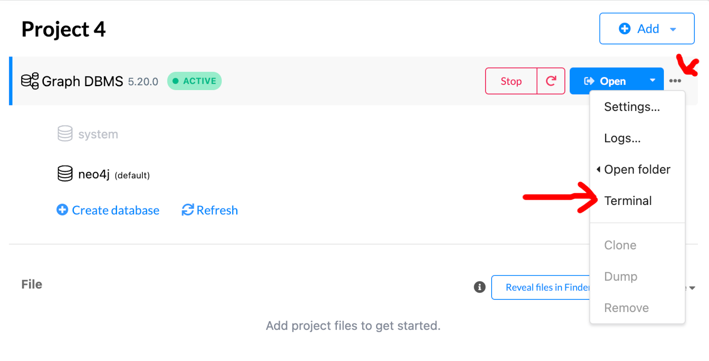
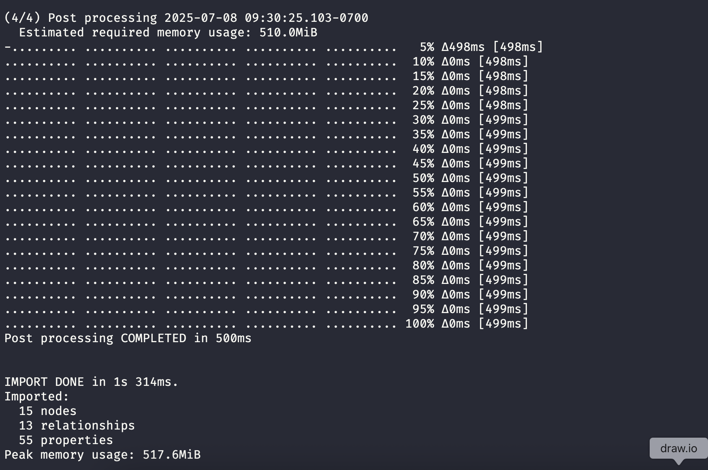
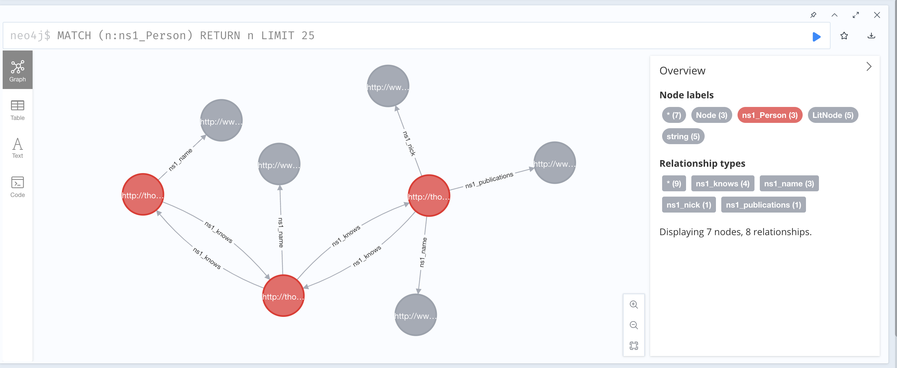
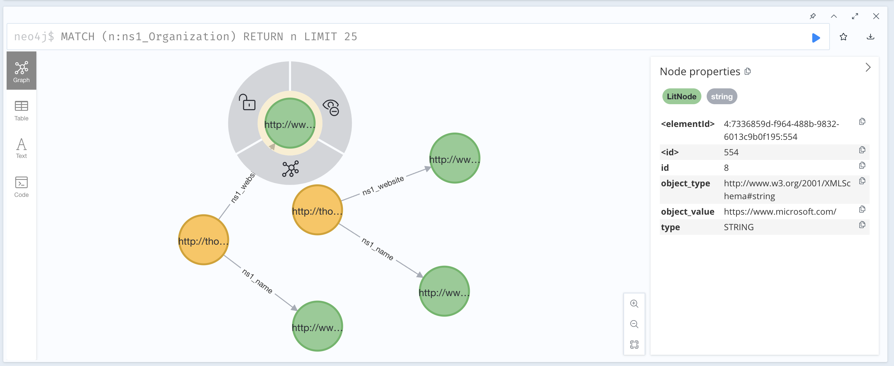

# Transforming Knowledge Graphs to Labeled Property Graphs with KG2PG

## Background

If you're reading this, then chances are you already know that there are two predominant frameworks for graph technology: RDF and LPG. Graphs in each framework differ from each other in several critical areas, mostly due to the different goals of each. While RDF aims to describe web resources while supporting logical reasoning on its data. Bringing these concepts over to RDF has been a topic of a number of papers; I've listed a few below to get an idea of interest in the field (don't actually read them).

2010 - [A Tale of Two Graphs: Property Graphs as RDF in Oracle](https://openproceedings.org/EDBT/2014/edbticdt2014industrial_submission_28.pdf)

2014 - [Reconciliation of RDF* and property graphs](https://arxiv.org/pdf/1409.3288)

2016 - [RDF data in property graph model](https://www.researchgate.net/publication/309695477_RDF_Data_in_Property_Graph_Model)

2018 - [Getting the best of Linked Data and Property Graphs: rdf2neo and the KnetMiner Use Case](https://ceur-ws.org/Vol-2275/paper14.pdf)

2018 - [Mapping RDF graphs to property graphs](https://arxiv.org/abs/1812.01801)

2019 - [ A unified relational storage scheme for RDF and property graphs](https://dl.acm.org/doi/abs/10.1007/978-3-030-30952-7_41)

2019 - [RDF and Property Graphs Interoperability: Status and Issues](https://ceur-ws.org/Vol-2369/paper01.pdf)

2020 - [The GraphBRAIN System for Knowledge Graph
Management and Advanced Fruition](https://www.researchgate.net/profile/Stefano-Ferilli/publication/344427830_The_GraphBRAIN_System_for_Knowledge_Graph_Management_and_Advanced_Fruition/links/61997ff9d7d1af224b11eaa9/The-GraphBRAIN-System-for-Knowledge-Graph-Management-and-Advanced-Fruition.pdf)

2020 - [G2GML: Graph to Graph Mapping Language for Bridging RDF and
Property Graphs](https://arxiv.org/abs/2203.06393)

2020 - [Mapping rdf databases to property graph databases](http://ieeexplore.ieee.org/document/9088985/)

2020 - [Describing Property Graphs in RDF](https://ieeexplore.ieee.org/document/9115617/)

2020 - [Transforming RDF to Property Graph in Hugegraph](https://dl.acm.org/doi/10.1145/3410352.3410833)

2021 - [Semantic Property Graph for Scalable Knowledge
Graph Analytics](https://arxiv.org/pdf/2009.07410)

2022 - [The OneGraph vision: Challenges of breaking
the graph model lock-in](https://journals.sagepub.com/doi/pdf/10.3233/SW-223273)

2022 - [Converting property graphs to RDF: a preliminary study of the practical impact of different mappings](https://dl.acm.org/doi/pdf/10.1145/3534540.3534695)

2022 - [Transforming RDF-star to Property Graphs: A Preliminary Analysis of Transformation Approaches](https://vbn.aau.dk/files/500778152/paper2.pdf)

2022 - [Converting Property Graphs to RDF: A Preliminary Study of the Practical Impact of Different Mappings]()

2020 - [LPG-based Ontologies as Schemas for Graph DBs](https://ceur-ws.org/Vol-3194/paper31.pdf)

2023 - [SKATEBOARD: semantic knowledge advanced tool for extraction, browsing, organisation, annotation, retrieval, and discovery](https://www.mdpi.com/2076-3417/13/21/11782)

2024 - [openCypher over RDF: Connecting Two Worlds](https://ceur-ws.org/Vol-3828/paper29.pdf)

2024 - [openCypher Queries over Combined RDF and LPG Data in Amazon Neptune](https://ceur-ws.org/Vol-3828/paper44.pdf)

2024 - [Statement Graphs: Unifying the Graph Data Model Landscape](https://link.springer.com/chapter/10.1007/978-981-97-5575-2_27)

2024 - [LPG Semantic Ontologies: A Tool for Interoperable Schema Creation and Management](https://www.mdpi.com/2078-2489/15/9/565)

My point here is that it's a topic people actively think and write about. When new papers are published about reconciliations between RDF and LPG - they're almost always exploring some small aspect (reasoning, or rdf*, or under special conditions). Because of the asterisks, caution, and red tape that usually comes with converting RDF to LPG - I tend to avoid the conversion process.

## Enter: Lossless Transformations of Knowledge Graphs to Property Graphs using Standardized Schemas

This paper was published in 2024 from the DKW Group at Aalborg University, Denmark. Based on the title, it sounds like they're using a standardized glue format to bridge the RDF and LPG models; to me this belongs in my bucket of metarepresentation solutions. In fact, the Abstract lays it all out.

> To enhance the in-teroperability of the two models, we present a novel technique, S3PG, to convert RDF knowledge graphs into property graphs ex-ploiting two popular standards to express schema constraints, i.e., SHACL for RDF and PG-Schema for property graphs. 

So there you have it. By using SHACL and PG-Schema you can transform your RDF knowledge graph to LPG. The authors released a a tool, [KG2PG](https://github.com/dkw-aau/KG2PG), on GitHub which allows mere mortals to convert their RDF to LPG.

**Important Note**: The tool relies on Neo4j's NeoSemantics plugin and writes data in a Neo4j specific format. If you're using other graph databases - this tool might not be for you.

## Evaluation

When it comes to testing RDF->LPG systems I find it easiest to focus on small bits of data at a time. To evaluate S3PG I'm deciding to use the foaf ontology with a fairly light A-Box, just enough to cover several cases. I don't believe there are official foaf SHACL shapes available however, the S3PG documentation suggests using [QSE](https://github.com/dkw-aau/qse) to extract SHACL shapes from RDF data.


### Step 1: Test Data

The simple abox below describes three people and two organizations. It's fairly light, but should give us something to look at as an LPG.

```
@prefix foaf: <http://xmlns.com/foaf/0.1/> .

<http://thomasthelen.com/novocab/person_1> a foaf:Person;
    foaf:name "Thomas Thelen" ;
    foaf:nick "Cool guy" ;
    foaf:publications "https://thomasthelen.com/publications/" ;
    foaf:knows <http://thomasthelen.com/novocab/person_2> .

<http://thomasthelen.com/novocab/person_2> a foaf:Person;
    foaf:name "Jane" ;
    foaf:knows <http://thomasthelen.com/novocab/person_1> ;
    foaf:knows <http://thomasthelen.com/novocab/person_3> .

<http://thomasthelen.com/novocab/person_3> a foaf:Person;
    foaf:name "Jerry" ;
    foaf:knows <http://thomasthelen.com/novocab/person_2> .

<http://thomasthelen.com/novocab/org_1> a foaf:Organization;
    foaf:name "Evil megacorp" ;
    foaf:website "https://www.google.com/" .

<http://thomasthelen.com/novocab/org_2> a foaf:Organization;
    foaf:name "Evil megacorp II" ;
    foaf:website "https://www.microsoft.com/" .
```

### Step 2: Generate SHACL Shapes

To generate the SHACL shapes you'll have to jump through a few hoops.

1. Clone QSE
2. Convert the ttl to n-triples
3. Safe the file somewhere
4. Open up the config.properties from the QSE root directory
5. Modify the paths to match where your data file is, and change the QSE directories to match your path
6. Run `java -jar -Xmx16g  jar/qse.jar config.properties &> output.logs`
7. Check the log file to make sure it worked
8. Find the shapes in the Output/ folder

### Step 3: Run KG2PG

KG2PG comes as an executable jar that looks for the shapes and data in a folder called `./data`.

1. Download KG2PG with `wget https://github.com/dkw-aau/KG2PG/releases/latest/download/kg2pg-v1.0.4.jar`
2. Create a `./data/` folder
3. Place the SHACL shapes and data in the folder
4. Modify config.properties to point to your data file and shapes file
5. Run KG2PG with `java -jar kg2pg-v1.0.4.jar`

The output should appear in the `./Output` folder. Note that there are several different files. If you open them - they should look like they have _something_ to do with your original dataset.

KG2PG has several other features, for example it can do change data capture on new data and also abstracts the process of putting the data in Neo4j. We won't make use of the first feature however, we will put the data in Neo4j to validate.


### Step 4: Loading into Neo4j

Now that the Neo4j data artifacts have been created, it's time to load them with the `neo4j-admin` tool. Each neo4j repositorydatabase has it's own `./bin` folder, which is where the tool lives.

1. Begin by creating a new new4j database
2. Add the NeoSemantics and cypher plugins
3. Open the neo4j terminal (see image below)
4. `cd bin`
5. Run `./neo4j-admin database import full --delimiter="|" --array-delimiter=";" --nodes=~/KG2PG/Output/data_2025-07-08_09-22-32_1751991752380/PG_NODES_LITERALS.csv --nodes=~/KG2PG/Output/data_2025-07-08_09-22-32_1751991752380/PG_NODES_WD_LABELS.csv --relationships=~/KG2PG/Output/data_2025-07-08_09-22-32_1751991752380/PG_RELATIONS.csv` (replace my paths with yours)
6. Open the Neo4j browser and check the graph

**Neo4j terminal**


**Output of the tool**



**Neo4j browser**

The time has finally come to look at the data as a labeled property graph. The first image below shows the three people, defined above in the RDF. Note how the name, nick, other string values are treated as first class nodes rather than as properties.



Same deal with the Organization node types.



## Concluding thoughts

The two tools create a neat pipeline for getting RDF data into Neo4j. _I'm still not sure how this compares to importing RDF with NeoSemantics_. With NeoSemantics, it's possible to import RDF data as-is, which seems to give okay results. As the LPG/RDF spaces continue to converge, I'll be keeping my eyes open for solutions with less configuration and process.

